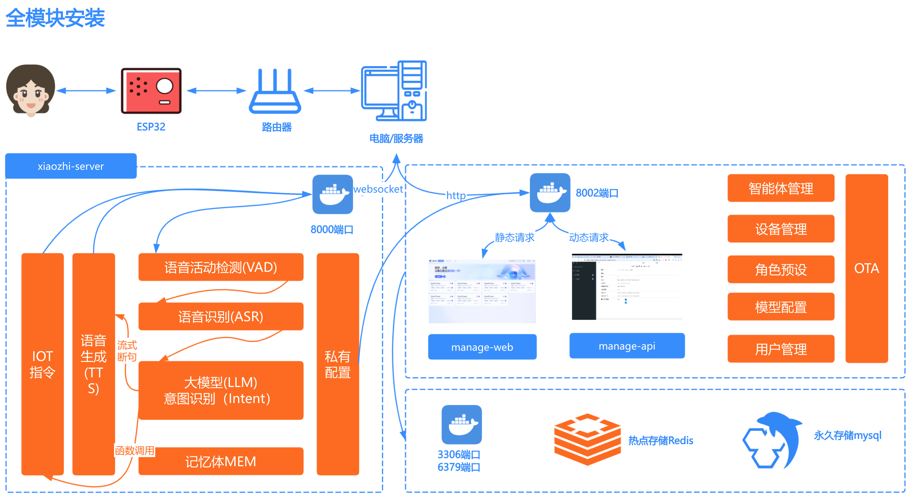

# 部署架构图

# 方式一：Docker运行全模块
docker镜像已支持x86架构、arm64架构的CPU，支持在国产操作系统上运行。

## 1. 安装docker

如果您的电脑还没安装docker，可以按照这里的教程安装：[docker安装](https://www.runoob.com/docker/ubuntu-docker-install.html)

#### 1.1 创建目录

安装完后，你需要为这个项目找一个安放配置文件的目录，例如我们可以新建一个文件夹叫`xiaozhi-server`。

创建好目录后，你需要在`xiaozhi-server`下面创建`data`文件夹和`models`文件夹，`models`下面还要再创建`SenseVoiceSmall`文件夹。

最终目录结构如下所示：

```
xiaozhi-server
  ├─ data
  ├─ models
     ├─ SenseVoiceSmall
```

#### 1.2 下载语音识别模型文件

本项目语音识别模型，默认使用`SenseVoiceSmall`模型，进行语音转文字。因为模型较大，需要独立下载，下载后把`model.pt`
文件放在`models/SenseVoiceSmall`
目录下。下面两个下载路线任选一个。

- 线路一：阿里魔塔下载[SenseVoiceSmall](https://modelscope.cn/models/iic/SenseVoiceSmall/resolve/master/model.pt)
- 线路二：百度网盘下载[SenseVoiceSmall](https://pan.baidu.com/share/init?surl=QlgM58FHhYv1tFnUT_A8Sg&pwd=qvna) 提取码:
  `qvna`


#### 1.3 下载配置文件

你需要下载两个配置文件：`docker-compose_all.yaml` 和 `config_from_api.yaml`。需要从项目仓库下载这两个文件。

##### 1.3.1 下载 docker-compose_all.yaml

用浏览器打开[这个链接](../main/xiaozhi-server/docker-compose_all.yml)。

在页面的右侧找到名称为`RAW`按钮，在`RAW`按钮的旁边，找到下载的图标，点击下载按钮，下载`docker-compose_all.yml`文件。 把文件下载到你的
`xiaozhi-server`中。

下载完后，回到本教程继续往下。

##### 1.3.2 下载 config_from_api.yaml

用浏览器打开[这个链接](../main/xiaozhi-server/config_from_api.yaml)。

在页面的右侧找到名称为`RAW`按钮，在`RAW`按钮的旁边，找到下载的图标，点击下载按钮，下载`config_from_api.yaml`文件。 把文件下载到你的
`xiaozhi-server`下面的`data`文件夹中，然后把`config_from_api.yaml`文件重命名为`.config.yaml`。

下载完配置文件后，我们确认一下整个`xiaozhi-server`里面的文件如下所示：

```
xiaozhi-server
  ├─ docker-compose_all.yml
  ├─ data
    ├─ .config.yaml
  ├─ models
     ├─ SenseVoiceSmall
       ├─ model.pt
```

如果你的文件目录结构也是上面的，就继续往下。如果不是，你就再仔细看看是不是漏操作了什么。

## 2. 安装Mysql和Redis

### 2.1 安装Mysql数据库
如果本机已经安装了MySQL，可以直接在数据库中创建名为`xiaozhi_esp32_server`的数据库。

```sql
CREATE DATABASE xiaozhi_esp32_server CHARACTER SET utf8mb4 COLLATE utf8mb4_unicode_ci;
```

如果还没有MySQL，你可以通过docker安装mysql

```
docker run --name xiaozhi-esp32-server-db -e MYSQL_ROOT_PASSWORD=123456 -p 3306:3306 -e MYSQL_DATABASE=xiaozhi_esp32_server -e MYSQL_INITDB_ARGS="--character-set-server=utf8mb4 --collation-server=utf8mb4_unicode_ci" -d mysql:latest
```

### 2.2 安装Redis

如果还没有Redis，你可以通过docker安装redis

```
docker run --name xiaozhi-esp32-server-redis -d -p 6379:6379 redis
```

## 3. 配置docker-compose_all.yml文件文件

在`xiaozhi-server`目录，打开docker-compose_all.yml，

1、修改`SPRING_DATASOURCE_DRUID_URL`里，把`192.168.1.25`修改成部署mysql的电脑局域网ip，如果是你本地，你要查看一下你本机的局域网ip是什么

2、修改`SPRING_DATA_REDIS_HOST`里，把`192.168.1.25`修改成部署redis的电脑局域网ip，如果是你本地，你要查看一下你本机的局域网ip是什么

3、确认一下mysql的用户名`SPRING_DATASOURCE_DRUID_USERNAME`和密码`SPRING_DATASOURCE_DRUID_PASSWORD`

## 4. 运行程序

确认mysql和redis是否运行正常，输入
```
docker ps
```
如果你能看到`xiaozhi-esp32-server-redis`和`xiaozhi-esp32-server-db`信息，就可以继续往下，如果看不到，说明你的`mysql`和`redis`没有安装或没有启动。需要继续回到上面的教程，看看哪一步漏了。

```
CONTAINER ID             IMAGE   COMMAND   CREATED  TATUS   PORTS               NAMES
xxx       redis          "xx"   xxx   xxx   0.0.0.0:6379->6379/tcp              xiaozhi-esp32-server-redis
xxx       mysql:latest   "xx"   xxx   xxx   0.0.0.0:3306->3306/tcp, 33060/tcp   xiaozhi-esp32-server-db
```

接下来打开命令行工具，使用`终端`或`命令行`工具 进入到你的`xiaozhi-server`，执行以下命令

```
docker-compose -f docker-compose_all.yml up -d
```

执行完后，再执行以下命令，查看日志信息。

```
docker logs -f xiaozhi-esp32-server-web
```

当你看到输出日志时，说明你的`智控台`启动成功了。

```
2025-xx-xx 22:11:12.445 [main] INFO  c.a.d.s.b.a.DruidDataSourceAutoConfigure - Init DruidDataSource
2025-xx-xx 21:28:53.873 [main] INFO  xiaozhi.AdminApplication - Started AdminApplication in 16.057 seconds (process running for 17.941)
http://localhost:8002/xiaozhi/doc.html
```

请注意此刻仅是`智控台`能运行，如果8000端口`xiaozhi-esp32-server`报错，先不要理会。

这时，你需要使用浏览器，打开`智控台`，链接：http://127.0.0.1:8002 ，注册第一个用户。第一个用户即是超级管理员，以后的用户都是普通用户。普通用户只能绑定设备和配置智能体;超级管理员可以进行模型管理、用户管理、参数配置等功能。

接下来要做两件重要的事情：

### 第一件重要的事情

使用超级管理员账号，登录系统，在顶部菜单找到`参数管理`，找到列表中第三条数据，参数编码是`server.secret`，复制它到`参数值`。

`server.secret`需要说明一下，这个`参数值`很重要，作用是让我们的`Server`端连接`manager-api`。`server.secret`是每次从零部署manager模块时，会自动随机生成的密钥。

复制`参数值`后，打开`xiaozhi-server`下的`data`目录的`.config.yaml`文件。此刻你的配置文件内容应该是这样的：

```
manager-api:
  url: http://127.0.0.1:8002/xiaozhi
  secret: 你的server.secret值
```
1、把你刚才从`智控台`复制过来的`server.secret`的`参数值`复制到`.config.yaml`文件里的`secret`里。

2、把`url`里的`127.0.0.1`改成你电脑局域网内的ip

类似这样的效果
```
manager-api:
  url: http://192.168.1.25:8002/xiaozhi
  secret: 12345678-xxxx-xxxx-xxxx-123456789000
```

保存好后，继续往下做第二件重要的事情

### 第二件重要的事情

使用超级管理员账号，登录系统，在顶部菜单找到`模型配置`，然后在左侧栏点击`大语言模型`，找到第一条数据`智谱AI`，点击`修改`按钮，
弹出修改框后，将你注册到的`智谱AI`的密钥填写到`API密钥`中。然后点击保存。

## 5.重启xiaozhi-esp32-server

接下来打开命令行工具，使用`终端`或`命令行`工具 输入
```
docker restart xiaozhi-esp32-server
docker logs -f xiaozhi-esp32-server
```
如果你能看到，类似以下日志,则是Server启动成功的标志。

```
25-02-23 12:01:09[core.websocket_server] - INFO - Server is running at ws://xxx.xx.xx.xx:8000/xiaozhi/v1/
25-02-23 12:01:09[core.websocket_server] - INFO - =======上面的地址是websocket协议地址，请勿用浏览器访问=======
25-02-23 12:01:09[core.websocket_server] - INFO - 如想测试websocket请用谷歌浏览器打开test目录下的test_page.html
25-02-23 12:01:09[core.websocket_server] - INFO - =======================================================
```

由于你是全模块部署，因此你有两个重要的接口需要写入到esp32中。

OTA接口：
```
http://你电脑局域网的ip:8002/xiaozhi/ota/
```

Websocket接口：
```
ws://你电脑局域网的ip:8000/xiaozhi/v1/
```

接下来，你就可以开始 [编译esp32固件](firmware-build.md)了。


## 6. 版本升级操作

如果后期想升级版本，先备份你的模型密钥。

进入`xiaozhi-server`目录

5.1、执行以下命令

```
docker-compose down
docker stop xiaozhi-esp32-server
docker rm xiaozhi-esp32-server
docker stop xiaozhi-esp32-server-web
docker rm xiaozhi-esp32-server-web
docker rmi ghcr.nju.edu.cn/xinnan-tech/xiaozhi-esp32-server:server_latest
docker rmi ghcr.nju.edu.cn/xinnan-tech/xiaozhi-esp32-server:web_latest
```

5.2、删掉`docker-compose_all.yaml`文件

5.3、重新按1.1开始部署

# 方式二：本地源码运行全模块

## 1.安装MySQL数据库

如果本机已经安装了MySQL，可以直接在数据库中创建名为`xiaozhi_esp32_server`的数据库。

```sql
CREATE DATABASE xiaozhi_esp32_server CHARACTER SET utf8mb4 COLLATE utf8mb4_unicode_ci;
```

如果还没有MySQL，你可以通过docker安装mysql

```
docker run --name xiaozhi-esp32-server-db -e MYSQL_ROOT_PASSWORD=123456 -p 3306:3306 -e MYSQL_DATABASE=xiaozhi_esp32_server -e MYSQL_INITDB_ARGS="--character-set-server=utf8mb4 --collation-server=utf8mb4_unicode_ci" -d mysql:latest
```

## 2.安装redis

如果还没有Redis，你可以通过docker安装redis

```
docker run --name xiaozhi-esp32-server-redis -d -p 6379:6379 redis
```

## 3.运行manager-api程序

3.1 安装JDK21，设置JDK环境变量

3.2 安装Maven，设置Maven环境变量

3.3 使用Vscode编程工具，安装好Java环境相关插件

3.4 使用Vscode编程工具加载manager-api模块

在`src/main/resources/application-dev.yml`中配置数据库连接信息

```
spring:
  datasource:
    username: root
    password: 123456
```
在`src/main/resources/application-dev.yml`中配置Redis连接信息
```
spring:
    data:
      redis:
        host: localhost
        port: 6379
        password:
        database: 0
```

3.5 运行主程序

本项目为SpringBoot项目，启动方式为：
打开`Application.java`运行`Main`方法启动

```
路径地址：
src/main/java/xiaozhi/AdminApplication.java
```

当你看到输出日志时，说明你的`manager-api`启动成功了。

```
2025-xx-xx 22:11:12.445 [main] INFO  c.a.d.s.b.a.DruidDataSourceAutoConfigure - Init DruidDataSource
2025-xx-xx 21:28:53.873 [main] INFO  xiaozhi.AdminApplication - Started AdminApplication in 16.057 seconds (process running for 17.941)
http://localhost:8002/xiaozhi/doc.html
```

## 4.运行manager-web程序

4.1 安装nodejs

4.2 使用Vscode编程工具加载manager-web模块

终端命令进入manager-web目录下

```
npm install
```
然后启动
```
npm run serve
```

请注意，如果你的manager-api的接口不在`http://localhost:8002`，请在开发时，修改
`main/manager-web/.env.development`中的路径

运行成功后，你需要使用浏览器，打开`智控台`，链接：http://127.0.0.1:8001 ，注册第一个用户。第一个用户即是超级管理员，以后的用户都是普通用户。普通用户只能绑定设备和配置智能体;超级管理员可以进行模型管理、用户管理、参数配置等功能。


重要：注册成功后，使用超级管理员账号，登录系统，在顶部菜单找到`模型配置`，然后在左侧栏点击`大语言模型`，找到第一条数据`智谱AI`，点击`修改`按钮，
弹出修改框后，将你注册到的`智谱AI`的密钥填写到`API密钥`中。然后点击保存。

重要：注册成功后，使用超级管理员账号，登录系统，在顶部菜单找到`模型配置`，然后在左侧栏点击`大语言模型`，找到第一条数据`智谱AI`，点击`修改`按钮，
弹出修改框后，将你注册到的`智谱AI`的密钥填写到`API密钥`中。然后点击保存。

重要：注册成功后，使用超级管理员账号，登录系统，在顶部菜单找到`模型配置`，然后在左侧栏点击`大语言模型`，找到第一条数据`智谱AI`，点击`修改`按钮，
弹出修改框后，将你注册到的`智谱AI`的密钥填写到`API密钥`中。然后点击保存。

## 5.安装Python环境

本项目使用`conda`管理依赖环境。如果不方便安装`conda`，需要根据实际的操作系统安装好`libopus`和`ffmpeg`。
如果确定使用`conda`，则安装好后，开始执行以下命令。

重要提示！windows 用户，可以通过安装`Anaconda`来管理环境。安装好`Anaconda`后，在`开始`那里搜索`anaconda`相关的关键词，
找到`Anaconda Prpmpt`，使用管理员身份运行它。如下图。


运行之后，如果你能看到命令行窗口前面有一个(base)字样，说明你成功进入了`conda`环境。那么你就可以执行以下命令了。


```
conda remove -n xiaozhi-esp32-server --all -y
conda create -n xiaozhi-esp32-server python=3.10 -y
conda activate xiaozhi-esp32-server

# 添加清华源通道
conda config --add channels https://mirrors.tuna.tsinghua.edu.cn/anaconda/pkgs/main
conda config --add channels https://mirrors.tuna.tsinghua.edu.cn/anaconda/pkgs/free
conda config --add channels https://mirrors.tuna.tsinghua.edu.cn/anaconda/cloud/conda-forge

conda install libopus -y
conda install ffmpeg -y
```

请注意，以上命令，不是一股脑执行就成功的，你需要一步步执行，每一步执行完后，都检查一下输出的日志，查看是否成功。

## 6.安装本项目依赖

你先要下载本项目源码，源码可以通过`git clone`命令下载，如果你不熟悉`git clone`命令。

你可以用浏览器打开这个地址`https://github.com/xinnan-tech/xiaozhi-esp32-server.git`

打开完，找到页面中一个绿色的按钮，写着`Code`的按钮，点开它，然后你就看到`Download ZIP`的按钮。

点击它，下载本项目源码压缩包。下载到你电脑后，解压它，此时它的名字可能叫`xiaozhi-esp32-server-main`
你需要把它重命名成`xiaozhi-esp32-server`，在这个文件里，进入到`main`文件夹，再进入到`xiaozhi-server`，好了请记住这个目录`xiaozhi-server`。

```
# 继续使用conda环境
conda activate xiaozhi-esp32-server
# 进入到你的项目根目录，再进入main/xiaozhi-server
cd main/xiaozhi-server
pip config set global.index-url https://mirrors.aliyun.com/pypi/simple/
pip install -r requirements.txt
```

### 7.下载语音识别模型文件

本项目语音识别模型，默认使用`SenseVoiceSmall`模型，进行语音转文字。因为模型较大，需要独立下载，下载后把`model.pt`
文件放在`models/SenseVoiceSmall`
目录下。下面两个下载路线任选一个。

- 线路一：阿里魔塔下载[SenseVoiceSmall](https://modelscope.cn/models/iic/SenseVoiceSmall/resolve/master/model.pt)
- 线路二：百度网盘下载[SenseVoiceSmall](https://pan.baidu.com/share/init?surl=QlgM58FHhYv1tFnUT_A8Sg&pwd=qvna) 提取码:
  `qvna`

## 8.配置项目文件

使用超级管理员账号，登录智控台 http://127.0.0.1:8001 ，在顶部菜单找到`参数管理`，找到列表中第三条数据，参数编码是`server.secret`，复制它到`参数值`。

`server.secret`需要说明一下，这个`参数值`很重要，作用是让我们的`Server`端连接`manager-api`。`server.secret`是每次从零部署manager模块时，会自动随机生成的密钥。

如果你的`xiaozhi-server`目录没有`data`，你需要创建`data`目录。
如果你的`data`下面没有`.config.yaml`文件，你可以把`xiaozhi-server`目录下的`config_from_api.yaml`文件复制到`data`，并重命名为`.config.yaml`

复制`参数值`后，打开`xiaozhi-server`下的`data`目录的`.config.yaml`文件。此刻你的配置文件内容应该是这样的：

```
manager-api:
  url: http://127.0.0.1:8002/xiaozhi
  secret: 你的server.secret值
```

把你刚才从`智控台`复制过来的`server.secret`的`参数值`复制到`.config.yaml`文件里的`secret`里。

类似这样的效果
```
manager-api:
  url: http://127.0.0.1:8002/xiaozhi
  secret: 12345678-xxxx-xxxx-xxxx-123456789000
```

## 5.运行项目

```
# 确保在xiaozhi-server目录下执行
conda activate xiaozhi-esp32-server
python app.py
```

如果你能看到，类似以下日志,则是本项目服务启动成功的标志。

```
25-02-23 12:01:09[core.websocket_server] - INFO - Server is running at ws://xxx.xx.xx.xx:8000/xiaozhi/v1/
25-02-23 12:01:09[core.websocket_server] - INFO - =======上面的地址是websocket协议地址，请勿用浏览器访问=======
25-02-23 12:01:09[core.websocket_server] - INFO - 如想测试websocket请用谷歌浏览器打开test目录下的test_page.html
25-02-23 12:01:09[core.websocket_server] - INFO - =======================================================
```

由于你是全模块部署，因此你有两个重要的接口需要写入到esp32中。

OTA接口：
```
http://你电脑局域网的ip:8002/xiaozhi/ota/
```

Websocket接口：
```
ws://你电脑局域网的ip:8000/xiaozhi/v1/
```

接下来，你就可以开始 [编译esp32固件](firmware-build.md)了。

# 常见问题

以下是一些常见问题，供参考：

[1、为什么我说的话，小智识别出来很多韩文、日文、英文](./FAQ.md)

[2、为什么会出现“TTS 任务出错 文件不存在”？](./FAQ.md)

[3、TTS 经常失败，经常超时](./FAQ.md)

[4、使用Wifi能连接自建服务器，但是4G模式却接不上](./FAQ.md)

[5、如何提高小智对话响应速度？](./FAQ.md)

[6、我说话很慢，停顿时小智老是抢话](./FAQ.md)

[7、我想通过小智控制电灯、空调、远程开关机等操作](./FAQ.md)
